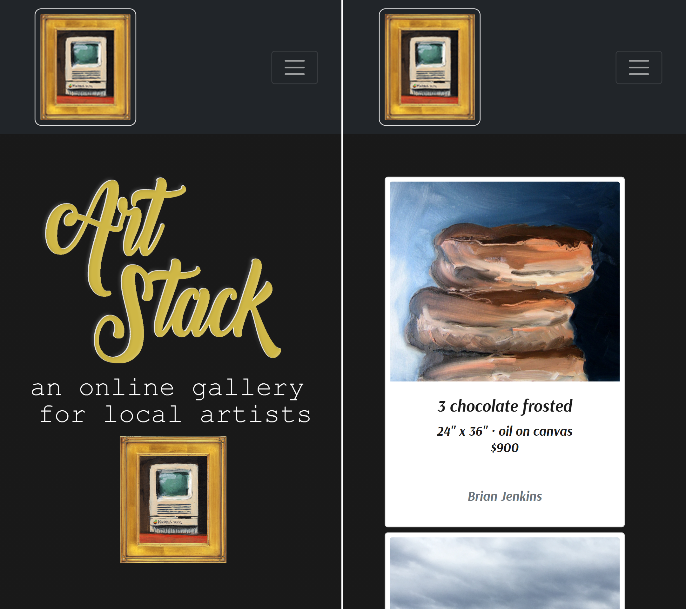
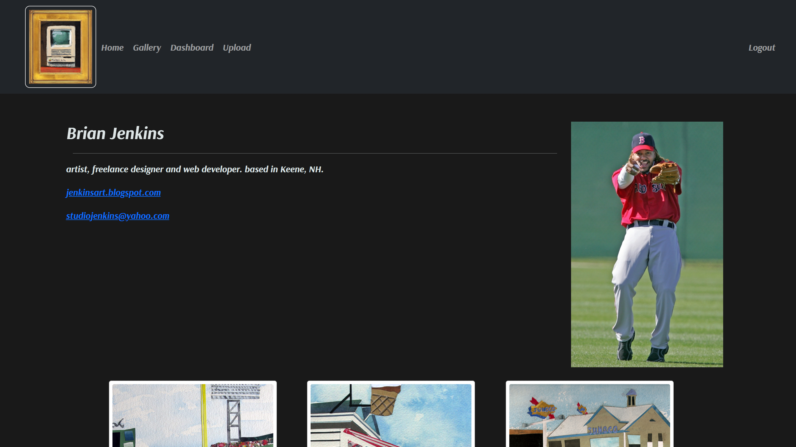

# Art Stack
 

Check it out [here](https://art-stack-0.herokuapp.com/)!

Art Stack provides an online gallery of artwork by community artists. It offers the opportunity for local artists to show their work despite pandemic-related closures, and offers the public the chance to see the extraordinary works of art being produced in our community with their safety and convenience in mind. 

## Project Overview

This app allows the user to browse through the art gallery, learn more about the local artists and to purchase their works of art. 
Art Stack is an example of an app that uses MYSQL with the Node.js run-time environment and Express.js framework with Sequelize ORM, organized via the MVC model.  

# View Demo  

To view demo click on this link: ([https://art-stack-0.herokuapp.com/](https://art-stack-0.herokuapp.com/))

# Getting Started   

- First clone this repo ([GIT](https://github.com/TheTiiiim/art-stack)).
- Install Node.js on your Mac ([Download](https://nodejs.org/en/)).
- Run `npm install` at the command line to install all required dependencies from package.json.
- Use `./db/schema.sql` to create your database.
- run `npm run seed` to fill the database with data.
- Run `npm start` to start the node application.

# Code Overview

## Dependencies

- [express](https://www.npmjs.com/package/express) 
- [dotenv](https://www.npmjs.com/package/dotenv) 
- [express-handlebars](https://www.npmjs.com/package/express-handlebars)
- [mysql](https://www.npmjs.com/package/mysql) 
- [bcrypt](https://www.npmjs.com/package/bcrypt)
- [sequelize](https://www.npmjs.com/package/sequelize)

## Dev Dependencies
- [eslint](https://www.npmjs.com/package/eslint)
- [nodemon](https://www.npmjs.com/package/nodemon) 

## Application MVC Structure

- `server.js` - The entry point to our application for the customer user type.
- `routes.js` - Entry point for the applications routes.
- `/views` - Applications template files using handlebars.
- `/routes` - The routes of this application.
- `/public` - All public facing assets are in this directory.
- `/models` - The application models for use with ORM.
- `/db` - Starter database files.
- `/controllers` - Most of the application's logic for requests and responses are done in this directory. 
- `/config` - Database configuration. 

## Contributors
- [Tim Scott](https://github.com/TheTiiiim)
- [Brain Jenkins](https://github.com/bjenkins63)
- [Matt Romano](https://github.com/MRomano84)
- [Edward Huang](https://github.com/Ejhuang2015)
- [Wanda Gleason](https://github.com/wmgleason)
